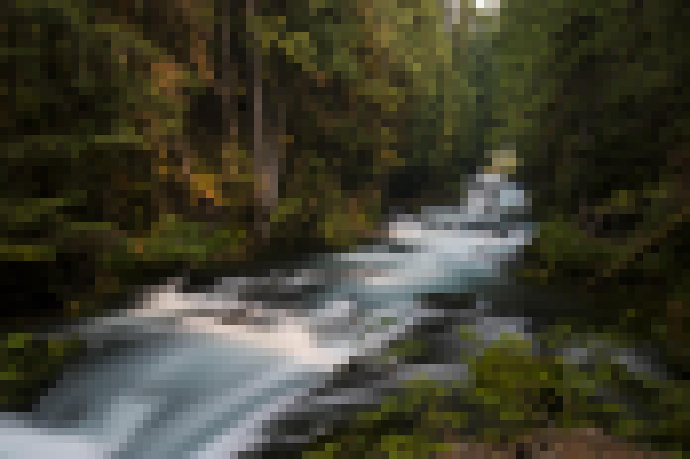

# Python Image Manipulation

### A group of python programs to manipulate and process images

To pixelate an image, use pixels.py with the image and the number of pixels you want in the final image

`python3 pixels.py sample.jpg 5000`

To jumble an image, use jumble.py with the image and the number of cubes you want

`python3 jumble.py sample.jpg 24`

To convert an image to ASCII characters, use ascii.py

`python3 ascii.py sample.jpg`

